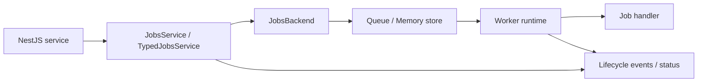

# @nestarc/jobs - v0.2.0 Technical Spec

Status: Historical draft (superseded; not an implementation contract)
Source: 2026-06-20 codebase and ecosystem research  
Target package: `@nestarc/jobs`

> This document preserves the original v0.2 planning proposal. Some capability tables and API
> sketches below were never implemented or were later changed. Do not use it as current package
> documentation; see [spec-v0.3.md](https://github.com/nestarc/jobs/blob/563612539401f49fa6b1ab0c9c265f79e8f61741/docs/spec-v0.3.md), [README.md](https://github.com/nestarc/jobs/blob/563612539401f49fa6b1ab0c9c265f79e8f61741/README.md), and
> [CHANGELOG.md](https://github.com/nestarc/jobs/blob/563612539401f49fa6b1ab0c9c265f79e8f61741/CHANGELOG.md) for the shipped behavior.

## 1. Summary

v0.2.0은 `@nestarc/jobs`를 "NestJS SaaS 애플리케이션을 위한 타입 안전하고 운영 가능한 작업 실행 계층"으로 끌어올리는 릴리스다.

v0.1은 인메모리 백엔드에서 테넌트 공정성을 검증하고, BullMQ 백엔드를 표준 FIFO 워커로 연결하며, `@JobHandler`, `JobsService.enqueue`, `FakeJobsService`, outbox bridge, `AsyncLocalStorage` 기반 컨텍스트 전파를 제공했다. v0.2.0은 이 기반 위에 다음을 표준화한다.

- 작업 타입 계약과 핸들러 타입 추론
- 백엔드별 지원 기능 명시와 설정 검증
- 작업 생명주기, 상태 조회, 실행 이력의 공통 모델
- 재시도, 백오프, 타임아웃의 백엔드 간 동작 일관성
- 테스트 더블이 실제 실행 의미론을 더 충실히 흉내 내는 결정적 테스트 API
- idempotency, DLQ, 관측성, outbox bridge 안정화의 최소 운영 표면

이 릴리스의 핵심은 "분산 공정성 완성"이 아니라 "안전하게 enqueue하고, 실행하고, 재시도하고, 추적할 수 있는 공통 작업 기반"이다. BullMQ에서 Redis Lua 기반 분산 fair dispatcher를 구현하는 작업은 v0.2.0 범위에서 제외한다.

## 2. Current Baseline

### 2.1 Implemented in v0.1

현재 코드베이스 기준으로 다음 기능은 이미 존재한다.

- `JobsModule.forInMemory(...)`
- `JobsModule.forBullMQ(...)`
- `JobsService.enqueue(type, payload, options?)`
- `@JobHandler(type)` 기반 핸들러 등록
- 인메모리 백엔드의 `FairWorker` 기반 테넌트 공정성
- BullMQ 백엔드의 표준 FIFO 워커 실행
- `JobExecutionContext` 전파
- outbox event를 job으로 연결하는 bridge
- 테스트용 `FakeJobsService`

### 2.2 Known Gaps

v0.2.0에서 우선 해결할 공백은 다음이다.

- 작업 type, payload, context, option 사이의 정적 타입 계약이 없다.
- 백엔드마다 가능한 기능이 다르지만, 기능 차이가 API나 설정 단계에서 드러나지 않는다.
- enqueue 이후 작업 상태, 실패 원인, retry history, DLQ 여부를 공통 방식으로 조회할 수 없다.
- retry, backoff, timeout 의미론이 백엔드 간 명확히 문서화되어 있지 않다.
- `FakeJobsService`가 delayed/retry/status 의미론까지 충분히 모델링하지 않는다.
- outbox bridge가 type mapping, idempotency key, tenant context 검증을 강하게 제공하지 않는다.
- 운영자가 최소한의 이벤트/메트릭/로그 정책을 적용하기 어렵다.

## 3. Product Positioning

### 3.1 Primary Users

- NestJS 기반 SaaS 백엔드 개발자
- 테넌트 컨텍스트가 필요한 webhook, email, report, sync, billing 작업을 운영하는 팀
- BullMQ를 직접 노출하지 않으면서도 로컬 테스트와 프로덕션 큐를 같은 코드로 다루고 싶은 팀
- outbox/event-driven 흐름을 job handler와 안전하게 연결하려는 팀

### 3.2 Differentiation

`@nestarc/jobs`는 범용 큐 라이브러리와 경쟁하지 않는다. 대신 다음 조합에 집중한다.

- NestJS DI와 decorator 기반 핸들러 통합
- SaaS tenant context 전파
- 테스트 더블과 실제 백엔드의 의미론 정렬
- 타입 안전한 job contract
- idempotency, retry, DLQ, status tracking의 작은 운영 표면
- outbox/event-driven 패키지와의 자연스러운 연결

BullMQ, pg-boss, Temporal, Inngest, Trigger.dev 같은 도구는 더 넓은 큐/워크플로/플랫폼 기능을 제공한다. `@nestarc/jobs`는 그보다 작고, NestJS 앱 내부에서 반복적으로 필요한 작업 실행 경계를 명확히 하는 데 집중한다.

## 4. Goals

### 4.1 P0 Goals

v0.2.0에서 반드시 포함한다.

1. Type-safe job contract
   - job type별 payload/context/result 타입을 선언한다.
   - `enqueue`, handler, fake helper에서 같은 타입 계약을 사용한다.
   - 기존 string 기반 API는 계속 동작한다.

2. Backend capability model
   - in-memory, fake, BullMQ 백엔드가 지원하는 기능을 명시한다.
   - 지원하지 않는 기능을 설정하면 module init 단계에서 실패하거나, 명시적으로 degrade한다.

3. Common lifecycle and status model
   - queued, delayed, active, succeeded, failed, retrying, dead_letter, cancelled 상태를 공통화한다.
   - job id 기준 조회 API를 제공한다.
   - 실패 원인과 attempt history를 최소한으로 기록한다.

4. Retry/backoff/timeout parity
   - 기본 동작은 v0.1과 호환되게 자동 retry 없음으로 둔다.
   - 명시한 retry/backoff/timeout 정책은 백엔드 간 같은 의미를 갖게 한다.
   - timeout은 cooperative cancellation으로 정의한다.

5. Deterministic testing API
   - fake backend가 delayed, retry, backoff, status transition을 결정적으로 검증할 수 있어야 한다.
   - 테스트는 Redis나 worker 프로세스 없이 실행 가능해야 한다.

### 4.2 P1 Goals

P0 구현 이후 v0.2.0 범위 안에서 포함하는 것을 목표로 한다.

1. Idempotency and dedupe
   - enqueue 단위 idempotency key를 지원한다.
   - tenant-scoped dedupe를 지원한다.
   - 기존 `enqueue(): Promise<string>` 반환값을 깨지 않도록 상세 반환 API를 별도로 둔다.

2. Dead-letter queue operations
   - dead-letter 상태 조회
   - 수동 replay
   - discard 또는 archive

3. Observability hooks
   - lifecycle event hook
   - metric label 정책
   - payload 비노출 로그 가이드

4. Outbox bridge hardening
   - typed event-to-job mapping
   - outbox event id 기반 idempotency key 연결
   - tenant context 검증

### 4.3 P2 Goals

v0.2.0에서 여유가 있으면 포함하거나, 명확히 v0.3 후보로 남긴다.

- Bull Board 또는 BullMQ dashboard 연결 가이드
- Prometheus/OpenTelemetry recipe
- tenant별 rate limit
- delayed job parity 확장
- per-tenant worker introspection

## 5. Non-goals

v0.2.0에서는 다음을 하지 않는다.

- BullMQ에서 Redis Lua 기반 distributed tenant fairness 구현
- 자체 management UI 구현
- workflow/saga/orchestration 엔진 구현
- cron scheduler 전체 기능 구현
- SQS, RabbitMQ, Kafka 등 추가 backend adapter 구현
- entitlement/billing 패키지와 자동 weight 연동
- payload 전체를 로그나 metric label에 노출하는 기능

## 6. Compatibility Policy

v0.2.0은 v0.1 사용자를 가능한 한 깨지 않게 업그레이드시키는 릴리스다.

### 6.1 Preserved APIs

다음 API는 유지한다.

```ts
JobsModule.forInMemory(options);
JobsModule.forBullMQ(options);

await jobs.enqueue("email.send", payload, options);

@JobHandler("email.send")
export class SendEmailHandler {
  async handle(payload: unknown, context: JobExecutionContext): Promise<void> {}
}
```

`JobsService.enqueue(...)`는 계속 `Promise<string>`을 반환한다. 반환값은 job id다.

### 6.2 Added APIs

v0.2.0의 새 타입 안전 API는 기존 API 위에 추가된다.

```ts
const appJobs = defineJobs({
  "email.send": job<SendEmailPayload>()
    .context<TenantJobContext>()
    .defaults({ attempts: 3 }),

  "webhook.deliver": job<WebhookDeliveryPayload>()
    .context<TenantJobContext>()
    .defaults({
      attempts: 5,
      backoff: { type: "exponential", delayMs: 1_000, maxDelayMs: 60_000 },
      timeoutMs: 30_000,
    }),
});

type AppJobs = typeof appJobs;
```

```ts
@InjectJobs<AppJobs>()
private readonly jobs: TypedJobsService<AppJobs>;

await this.jobs.enqueue("email.send", {
  messageId: "msg_123",
});
```

기존 `@JobHandler(type)` decorator는 유지한다. 타입 안전 핸들러는 opt-in으로 제공한다.

```ts
@JobHandler("email.send")
export class SendEmailHandler implements TypedJobHandler<AppJobs, "email.send"> {
  async handle(job: JobInstance<AppJobs, "email.send">): Promise<void> {
    job.payload.messageId;
    job.context.tenantId;
  }
}
```

기존 handler signature도 v0.2.0에서 계속 지원한다.

```ts
async handle(payload: SendEmailPayload, context: JobExecutionContext): Promise<void> {}
```

## 7. Architecture

### 7.1 High-level Flow



### 7.2 Backend Responsibilities

Every backend implements the same logical boundary.

```ts
export interface JobsBackend {
  readonly name: string;
  capabilities(): BackendCapabilities;
  enqueue(input: BackendEnqueueInput): Promise<BackendEnqueueResult>;
  getJob(jobId: string): Promise<JobRecord | null>;
  getJobHistory(jobId: string): Promise<JobHistoryEntry[]>;
  start?(): Promise<void>;
  pause?(): Promise<void>;
  drain?(options?: DrainOptions): Promise<void>;
  close?(): Promise<void>;
}
```

`JobsService` owns public API compatibility and typed contract validation. Backends own persistence, worker integration, state transition storage, and capability-specific implementation.

### 7.3 Context Propagation

Every job has an execution context.

```ts
export interface JobExecutionContext {
  jobId: string;
  type: string;
  tenantId?: string;
  traceId?: string;
  correlationId?: string;
  attempt: number;
  maxAttempts: number;
  enqueuedAt: Date;
  startedAt?: Date;
  signal: AbortSignal;
  metadata: Record<string, unknown>;
}
```

Rules:

- `AsyncLocalStorage` context is captured at enqueue time unless an explicit context is provided.
- Explicit context wins over ambient context.
- Handler execution runs inside the job execution context.
- `tenantId` is optional by default for compatibility.
- Applications can require tenant context with `tenant.required: true`.

## 8. Type-safe Job Contract

### 8.1 Contract Builder

The contract builder is runtime-light and type-heavy.

```ts
export const jobs = defineJobs({
  "report.generate": job<GenerateReportPayload>()
    .context<TenantJobContext>()
    .result<GenerateReportResult>()
    .defaults({
      attempts: 2,
      timeoutMs: 120_000,
    }),
});
```

The runtime value is used for module registration and metadata lookup.

```ts
JobsModule.forBullMQ({
  jobs,
  connection,
  namespace: "app",
});
```

### 8.2 Typed Service

```ts
export interface TypedJobsService<TJobs extends JobDefinitions> {
  enqueue<TType extends JobType<TJobs>>(
    type: TType,
    payload: JobPayload<TJobs, TType>,
    options?: EnqueueOptions<JobContext<TJobs, TType>>,
  ): Promise<string>;

  enqueueDetailed<TType extends JobType<TJobs>>(
    type: TType,
    payload: JobPayload<TJobs, TType>,
    options?: EnqueueOptions<JobContext<TJobs, TType>>,
  ): Promise<EnqueueResult>;

  getJob<TType extends JobType<TJobs> = JobType<TJobs>>(
    jobId: string,
  ): Promise<TypedJobRecord<TJobs, TType> | null>;
}
```

`enqueueDetailed` is the new API for idempotency/dedupe visibility. `enqueue` remains compatible and returns only the job id.

### 8.3 Typed Handler

```ts
export interface TypedJobHandler<
  TJobs extends JobDefinitions,
  TType extends JobType<TJobs>,
> {
  handle(job: JobInstance<TJobs, TType>): Promise<JobResult<TJobs, TType>>;
}
```

`JobInstance` contains `id`, `type`, `payload`, `context`, `attempt`, `signal`, and metadata. It does not expose backend-native BullMQ objects by default.

### 8.4 Runtime Validation

v0.2.0 does not require a schema library. The type contract is TypeScript-first.

Optional runtime validation can be added with a minimal adapter shape.

```ts
job<CreateInvoicePayload>().schema(createInvoiceSchema);
```

Schema support is allowed only if it does not introduce a required dependency on Zod, Valibot, or class-validator.

## 9. Backend Capability Model

### 9.1 Capability Shape

```ts
export interface BackendCapabilities {
  durable: boolean;
  distributed: boolean;
  delayed: boolean;
  retries: boolean;
  backoff: boolean;
  timeout: boolean;
  statusQuery: boolean;
  history: boolean;
  idempotency: boolean;
  deadLetter: boolean;
  fairness: "none" | "local-tenant";
  manualDrain: boolean;
}
```

### 9.2 Expected Capabilities

| Capability | Fake | In-memory | BullMQ |
| --- | --- | --- | --- |
| durable | false | false | true |
| distributed | false | false | true |
| delayed | true | true | true |
| retries | true | true | true |
| backoff | true | true | true |
| timeout | true | true | true |
| statusQuery | true | true | true |
| history | true | true | true |
| idempotency | true | true | true |
| deadLetter | true | true | true |
| fairness | local-tenant | local-tenant | none |
| manualDrain | true | true | true |

Notes:

- BullMQ fairness remains `none` in v0.2.0 because the current backend uses standard FIFO workers.
- Fake supports capabilities for deterministic tests, not durability.
- In-memory supports local process behavior only.

### 9.3 Capability Enforcement

```ts
JobsModule.forBullMQ({
  jobs,
  connection,
  strictCapabilities: true,
});
```

When `strictCapabilities` is `true`, unsupported configured features fail during module initialization. When false, the package may degrade only if the degradation is explicit and documented through a warning event.

Examples:

- Configuring `fairness: "tenant"` on BullMQ fails in v0.2.0.
- Configuring delayed jobs on fake/in-memory/BullMQ succeeds.
- Configuring durable storage on fake or in-memory fails.

## 10. Lifecycle and Status

### 10.1 Status Model

```ts
export type JobStatus =
  | "queued"
  | "delayed"
  | "active"
  | "succeeded"
  | "failed"
  | "retrying"
  | "dead_letter"
  | "cancelled";
```

### 10.2 Job Record

```ts
export interface JobRecord<TPayload = unknown, TContext = unknown> {
  id: string;
  type: string;
  status: JobStatus;
  payload?: TPayload;
  context?: TContext;
  attempt: number;
  maxAttempts: number;
  enqueuedAt: Date;
  scheduledFor?: Date;
  startedAt?: Date;
  completedAt?: Date;
  failedAt?: Date;
  nextAttemptAt?: Date;
  error?: JobErrorSummary;
  idempotencyKey?: string;
  dedupeKey?: string;
  metadata: Record<string, unknown>;
}
```

By default, `getJob` may return payload/context only inside the process or when explicitly configured. For durable backends, applications should be able to disable payload return to avoid leaking sensitive data.

### 10.3 History Entries

```ts
export interface JobHistoryEntry {
  jobId: string;
  status: JobStatus;
  attempt: number;
  at: Date;
  reason?: string;
  error?: JobErrorSummary;
  metadata?: Record<string, unknown>;
}
```

History is bounded. Default retention is backend-specific, but v0.2.0 must expose configuration.

```ts
history: {
  maxEntriesPerJob: 25,
  includePayload: false,
}
```

## 11. Retry, Backoff, and Timeout

### 11.1 Retry Policy

```ts
export interface RetryPolicy {
  attempts?: number;
  backoff?: BackoffPolicy;
  retryOn?: JobRetryPredicate;
  discardOn?: JobDiscardPredicate;
}

export type BackoffPolicy =
  | { type: "fixed"; delayMs: number; jitter?: number }
  | { type: "exponential"; delayMs: number; maxDelayMs?: number; jitter?: number };
```

Rules:

- Default `attempts` is `1`, meaning no automatic retry.
- `attempts` includes the first attempt.
- `retryOn` runs after handler failure.
- `discardOn` wins over `retryOn`.
- Retry scheduling creates `retrying` then `delayed`/`queued` depending on backend representation.

### 11.2 Timeout Policy

```ts
export interface TimeoutPolicy {
  timeoutMs?: number;
}
```

Timeout behavior:

- v0.2.0 uses cooperative cancellation.
- The handler receives `AbortSignal` through `JobExecutionContext.signal` and typed `JobInstance.signal`.
- When timeout expires, the signal is aborted and the job is marked failed with reason `timeout`.
- The package cannot forcibly terminate synchronous CPU-bound user code.
- Documentation must state that long-running handlers should check the signal or pass it to I/O clients.

### 11.3 Policy Precedence

Effective policy is resolved in this order:

1. Enqueue options
2. Job definition defaults
3. Module defaults
4. Package defaults

Package defaults:

```ts
{
  attempts: 1,
  timeoutMs: undefined,
  backoff: undefined,
}
```

## 12. Idempotency and Dedupe

### 12.1 Enqueue Options

```ts
export interface EnqueueOptions<TContext = unknown> {
  context?: TContext;
  delayMs?: number;
  scheduledFor?: Date;
  attempts?: number;
  backoff?: BackoffPolicy;
  timeoutMs?: number;
  idempotencyKey?: string;
  dedupe?: DedupeOptions;
  metadata?: Record<string, unknown>;
}

export interface DedupeOptions {
  key: string;
  scope?: "global" | "tenant";
  ttlMs?: number;
  mode?: "while_active" | "until_completed";
}
```

`idempotencyKey` is a producer-side identity for the enqueue operation. `dedupe.key` is a job equivalence key used to prevent duplicate work.

### 12.2 Detailed Result

```ts
export type EnqueueResult =
  | {
      status: "created";
      jobId: string;
    }
  | {
      status: "deduped";
      jobId: string;
      existingJobId: string;
    };
```

`enqueue` returns the effective job id in both cases. `enqueueDetailed` exposes whether a new job was created.

### 12.3 Backend Semantics

- Fake and in-memory can implement idempotency with local maps.
- BullMQ should use stable job ids or Redis-side dedupe primitives where available.
- Tenant-scoped dedupe requires a tenant id. If `scope: "tenant"` is used without tenant context, enqueue fails.
- Dedupe keys must not contain raw PII. Docs should recommend hashed or internal identifiers.

## 13. Dead-letter Queue

### 13.1 Dead-letter Transition

A job moves to `dead_letter` when:

- all attempts are exhausted, and
- `deadLetter.enabled !== false`.

Default:

```ts
deadLetter: {
  enabled: true,
}
```

### 13.2 Operations

```ts
export interface DeadLetterJobsService {
  listDeadLetters(filter?: DeadLetterFilter): Promise<JobRecord[]>;
  replayDeadLetter(jobId: string, options?: ReplayOptions): Promise<string>;
  discardDeadLetter(jobId: string, reason?: string): Promise<void>;
}
```

`replayDeadLetter` creates a new job id by default. An option can preserve the original id only if the backend safely supports it.

```ts
export interface ReplayOptions {
  preserveOriginalId?: boolean;
  resetAttempts?: boolean;
  metadata?: Record<string, unknown>;
}
```

### 13.3 Safety

- Replay must emit lifecycle events.
- Replay must not silently bypass idempotency.
- Discard must record a history entry.
- Payload logging remains disabled by default.

## 14. Deterministic Testing API

### 14.1 Fake Backend

`FakeJobsService` remains available, but v0.2.0 adds a fake backend/runtime that models lifecycle state.

```ts
const fake = createFakeJobs<AppJobs>();

const jobId = await fake.enqueue("webhook.deliver", { deliveryId: "del_1" }, {
  context: { tenantId: "tenant_1" },
  attempts: 3,
  backoff: { type: "fixed", delayMs: 1_000 },
});

await fake.drainUntilIdle();
expect(await fake.getJob(jobId)).toMatchObject({ status: "succeeded" });
```

### 14.2 Clock Control

```ts
fake.clock.now();
fake.clock.advanceBy(1_000);
fake.clock.set(new Date("2026-06-20T00:00:00.000Z"));
```

Delayed and retry jobs run only when fake time reaches their scheduled time.

### 14.3 Assertions

The package may expose assertion helpers, but they must be optional and test-runner neutral.

```ts
fake.findEnqueued("email.send");
fake.getAttempts(jobId);
fake.getHistory(jobId);
fake.clear();
```

Do not hard-depend on Jest.

## 15. Observability

### 15.1 Lifecycle Events

```ts
export type JobLifecycleEventType =
  | "job.enqueued"
  | "job.started"
  | "job.succeeded"
  | "job.failed"
  | "job.retry_scheduled"
  | "job.dead_lettered"
  | "job.cancelled"
  | "job.discarded"
  | "job.replayed";

export interface JobLifecycleEvent {
  type: JobLifecycleEventType;
  jobId: string;
  jobType: string;
  tenantId?: string;
  attempt: number;
  at: Date;
  durationMs?: number;
  error?: JobErrorSummary;
  metadata?: Record<string, unknown>;
}
```

### 15.2 Hooks

```ts
JobsModule.forBullMQ({
  jobs,
  connection,
  events: {
    onEvent(event) {
      logger.info({ event }, "job lifecycle event");
    },
  },
});
```

Rules:

- Payload is not included in lifecycle events by default.
- Error summaries include class/name, message, and optional code.
- Stack traces are configurable and disabled in structured events by default.

### 15.3 Metrics Recipe

v0.2.0 should document, not necessarily bundle, metrics such as:

- `jobs_enqueued_total`
- `jobs_started_total`
- `jobs_succeeded_total`
- `jobs_failed_total`
- `jobs_dead_lettered_total`
- `jobs_duration_ms`
- `jobs_queue_latency_ms`

Recommended labels:

- `job_type`
- `status`
- `backend`

Avoid high-cardinality labels such as `job_id`, raw `tenant_id`, user id, email, URL, or idempotency key.

## 16. Outbox Bridge Hardening

### 16.1 Typed Mapping

```ts
OutboxJobsBridge.forEvents<AppOutboxEvents, AppJobs>({
  events: {
    "invoice.created": {
      job: "email.send",
      payload: (event) => ({ messageId: event.payload.messageId }),
      context: (event) => ({ tenantId: event.tenantId }),
      idempotencyKey: (event) => event.id,
    },
  },
});
```

### 16.2 Required Rules

- The bridge must not enqueue a job when mapping fails validation.
- When an outbox event has a stable id, it should be used as the default idempotency key.
- Tenant context must be explicit or derived by a configured function.
- Mapping failures should be visible as bridge errors, not silently swallowed.

### 16.3 Delivery Semantics

Outbox-to-job delivery remains at-least-once. Job handlers must still be idempotent. v0.2.0 reduces accidental duplicates but does not promise exactly-once external side effects.

## 17. NestJS Integration

### 17.1 Module Options

```ts
export interface JobsModuleOptions<TJobs extends JobDefinitions = JobDefinitions> {
  jobs?: TJobs;
  namespace?: string;
  global?: boolean;
  defaults?: JobDefaults;
  strictCapabilities?: boolean;
  tenant?: {
    required?: boolean;
    systemTenantId?: string;
  };
  history?: {
    maxEntriesPerJob?: number;
    includePayload?: boolean;
  };
  deadLetter?: {
    enabled?: boolean;
  };
  events?: JobEventsOptions;
}
```

Compatibility:

- `global` defaults to current v0.1 behavior.
- v0.2.0 may add `global: false`, but must not change the default without a migration note.

### 17.2 Async Configuration

```ts
JobsModule.forBullMQAsync({
  imports: [ConfigModule],
  inject: [ConfigService],
  useFactory: (config: ConfigService) => ({
    jobs,
    connection: {
      url: config.getOrThrow("REDIS_URL"),
    },
  }),
});
```

If `forRootAsync` already exists by implementation time, v0.2.0 should align naming with existing Nest conventions and avoid duplicate variants.

### 17.3 Worker Lifecycle

The package must support graceful shutdown.

```ts
await jobs.pause();
await jobs.drain({ timeoutMs: 30_000 });
await jobs.close();
```

Shutdown rules:

- stop accepting new local work during drain
- allow active handlers to finish until timeout
- abort active handlers on timeout through their `AbortSignal`
- close backend resources
- expose failures during shutdown instead of swallowing them

## 18. Security and Privacy

v0.2.0 must treat job payloads as potentially sensitive.

Rules:

- Do not log payload by default.
- Do not put raw payload values into metric labels.
- Do not expose payload/context from status APIs unless configured.
- Redact error metadata when converting unknown errors to `JobErrorSummary`.
- Document that handlers must be idempotent before enabling retries.
- Document tenant-scoped dedupe failure when tenant id is absent.

Optional config:

```ts
privacy: {
  includePayloadInStatus?: false,
  includeStackTraceInEvents?: false,
  redactErrorMessage?: (message: string) => string,
}
```

## 19. Backend-specific Notes

### 19.1 Fake

Fake backend is for tests.

- no durability
- deterministic clock
- deterministic drain
- full lifecycle history
- typed helper support
- no external dependencies

### 19.2 In-memory

In-memory backend is for local development, tests, and single-process use.

- no durability
- local tenant fairness remains supported
- local maps for idempotency/DLQ/history
- useful as a reference implementation for semantics

### 19.3 BullMQ

BullMQ backend is for production queueing.

- durable Redis-backed queue
- standard BullMQ FIFO worker in v0.2.0
- retry/backoff should map to BullMQ options where possible
- timeout should be enforced by wrapper and cooperative signal
- status/history should normalize BullMQ states into `JobStatus`
- raw BullMQ queue access should remain an escape hatch only if already present or necessary

BullMQ distributed fairness is explicitly out of scope for v0.2.0.

## 20. Documentation Requirements

v0.2.0 docs should include:

- migration guide from v0.1
- typed contract quickstart
- in-memory local development example
- BullMQ production example
- fake deterministic testing example
- retry/backoff/timeout guide
- idempotency and dedupe guide
- DLQ replay guide
- outbox bridge guide
- observability and privacy guide
- backend capability matrix

The existing v0.1 spec should either remain archived or be clearly labeled as historical once v0.2 docs land.

## 21. Test Plan

### 21.1 Unit Tests

- job contract type helpers compile as expected
- policy precedence resolution
- capability validation
- status transition reducer
- backoff calculation including jitter bounds
- error summary normalization

### 21.2 Type Tests

- `enqueue` rejects wrong payload type
- handler sees inferred payload/context/result
- unknown job type fails for typed service
- legacy string service remains usable

Use `tsd`, `expect-type`, or local TypeScript compile fixtures. Avoid coupling fake assertion helpers to a single test runner.

### 21.3 Backend Contract Tests

Run the same behavior suite against fake, in-memory, and BullMQ where applicable.

- enqueue to queued
- delay to active only after scheduled time
- success transition
- failure transition
- retry scheduling
- exhausted retries to DLQ
- timeout failure
- idempotency duplicate
- tenant-scoped dedupe
- status/history lookup
- drain and close

### 21.4 Integration Tests

- Nest module registration with typed jobs
- handler discovery
- `AsyncLocalStorage` context capture
- outbox bridge mapping
- BullMQ Redis-backed execution
- graceful shutdown

### 21.5 Security Tests

- lifecycle events do not include payload by default
- metrics recipe does not encourage high-cardinality or sensitive labels
- status API can omit payload/context
- tenant-scoped dedupe without tenant id fails

## 22. Acceptance Criteria

v0.2.0 is ready when:

- Existing v0.1 public examples continue to compile or have an explicit migration note.
- Typed job contract examples compile.
- A single behavior test suite passes for fake and in-memory.
- BullMQ passes the supported subset of backend contract tests.
- Unsupported capability configuration fails clearly when strict mode is enabled.
- Retry/backoff/timeout semantics are documented and tested.
- `enqueue` remains `Promise<string>`.
- `enqueueDetailed` exposes created vs deduped state.
- Status and history APIs work for all supported backends.
- DLQ replay/discard behavior is tested.
- Docs state that BullMQ tenant fairness is not implemented in v0.2.0.

## 23. Migration Guide Outline

### 23.1 Minimal Upgrade

No code changes required for existing string-based usage.

```ts
await jobs.enqueue("email.send", payload);
```

### 23.2 Adopt Typed Jobs

Add a job contract and inject typed service.

```ts
export const appJobs = defineJobs({
  "email.send": job<SendEmailPayload>().context<TenantJobContext>(),
});
```

```ts
@InjectJobs<typeof appJobs>()
private readonly jobs: TypedJobsService<typeof appJobs>;
```

### 23.3 Adopt Retry Safely

Retries are opt-in.

```ts
await jobs.enqueue("webhook.deliver", payload, {
  attempts: 5,
  backoff: { type: "exponential", delayMs: 1_000, maxDelayMs: 60_000 },
  idempotencyKey: deliveryId,
});
```

Before enabling retries, handlers that call external services must be idempotent or protected with external idempotency keys.

### 23.4 Adopt Dedupe

```ts
await jobs.enqueueDetailed("report.generate", payload, {
  context: { tenantId },
  dedupe: {
    key: `report:${reportId}`,
    scope: "tenant",
    mode: "while_active",
  },
});
```

Use `enqueueDetailed` when the caller needs to know whether a duplicate was suppressed.

## 24. Open Questions

These decisions should be finalized before implementation starts.

1. Should `defineJobs` live in the root export or a `/contracts` subpath?
2. Should typed handlers require `handle(job)` or should the typed decorator support the legacy `handle(payload, context)` signature directly?
3. Should status APIs return payload/context by default for in-memory and fake, or should privacy defaults be identical across backends?
4. Should DLQ be enabled by default for all backends, including fake and in-memory?
5. Should BullMQ raw queue access be documented as public API or kept internal?
6. Which type-test tool should the repo standardize on?

## 25. Implementation Slices

Recommended delivery order:

1. Contract types and typed service facade
2. Capability model and backend contract tests
3. Lifecycle/status/history model
4. Retry/backoff/timeout parity
5. Fake runtime with deterministic clock
6. Idempotency/dedupe
7. DLQ operations
8. Observability hooks
9. Outbox bridge hardening
10. Documentation and migration guide

This order reduces risk because each later slice can be verified against the common backend behavior suite.
