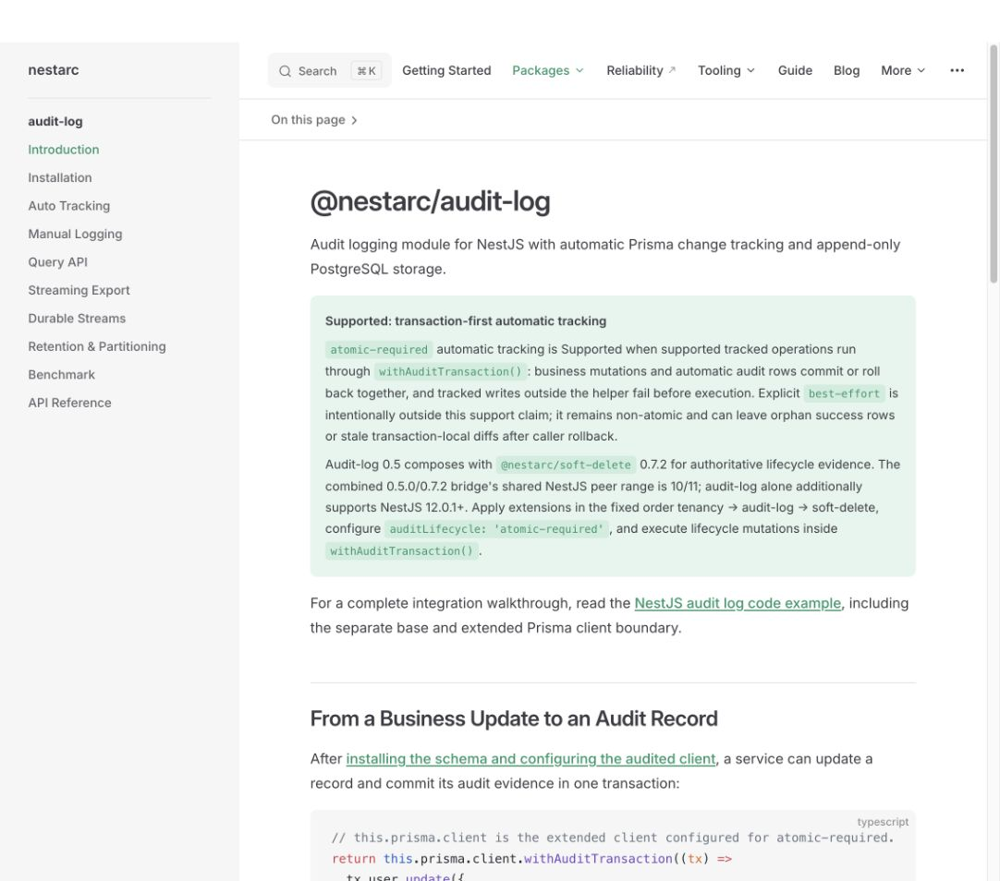
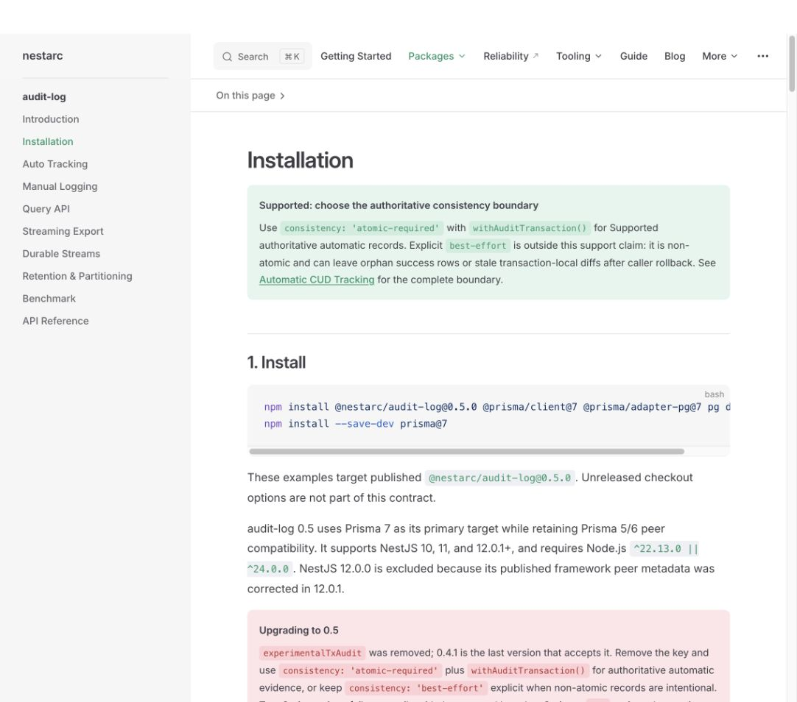
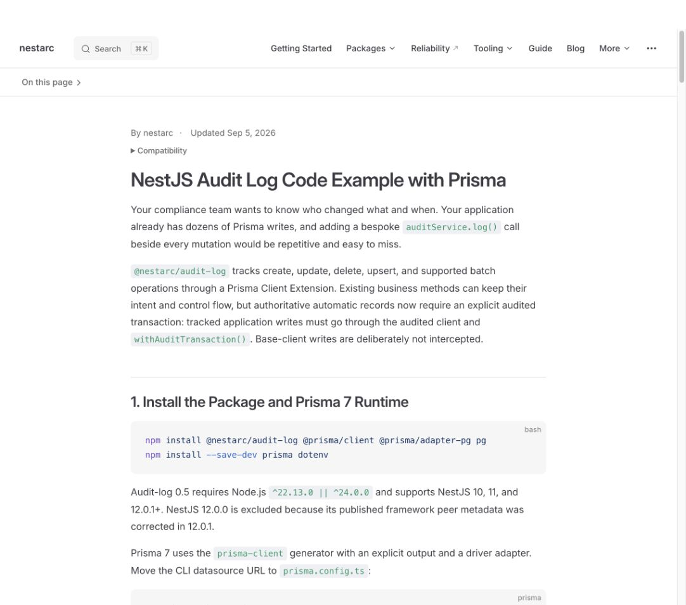

# audit-log 0.7.0 사이트 반영 및 채택 경로 검토

검토일: 2026-09-29 (Asia/Seoul). 범위: 배포 변경 확인, 공개 사이트의 신규 방문자 흐름, 구체적인 콘텐츠 변경안. 이 문서는 검토 결과이며 사이트 구현·배포는 수행하지 않았다. `docs/seo-reports/**`는 사이트 빌드에서 제외된다.

**권고: “기존 NestJS 앱에 업무 이벤트 하나부터 도입하고, 첫 기록의 정확성을 확인한다”를 중심으로 소개 → 도입 방법 선택 → 실행 → 결과 확인 흐름을 구성한다.** 0.7.0 기능은 이 흐름을 더 쉽게, 더 명확하게 만드는 근거로 설명한다.

## 1. 배포 확인과 변경의 의미

- npm `latest`: `0.7.0`. 게시 시각: 2026-09-29 22:03:47 KST.
- registry `gitHead`: `b32020fcd6fc6002719170b4df4a8defc13dbb0e`.
- 실제 npm tarball을 내려받아 SHA-512가 registry integrity와 일치하는지 확인했다. 실행하지 않고 배포물의 타입 선언에서 `defineAuditConfig` export와 `actorRequired`를 확인했다.
- [Release workflow](https://github.com/nestarc/nestjs-audit-log/actions/runs/36571931446)는 성공했다.
- 배포 후 [검증 기록](https://github.com/nestarc/nestjs-audit-log/blob/4b4dd4e03c43e4de8783161fa19cb4f687301a0a/docs/2026-09-29-v0.7.0-adoption-implementation-plan.md)은 실제 registry 0.7.0으로 strict peer 설치, manual/HTTP smoke, 8개 adoption 시나리오를 통과했다고 보고한다. 이번 검토에서 DB smoke를 다시 실행한 것은 아니다.

출처: [npm metadata](https://registry.npmjs.org/@nestarc%2faudit-log/0.7.0), [0.7.0 변경 이력](https://github.com/nestarc/nestjs-audit-log/blob/v0.7.0/CHANGELOG.md), [0.6.0 → 0.7.0 diff](https://github.com/nestarc/nestjs-audit-log/compare/v0.6.0...v0.7.0).

| 변경 | 사용자가 얻는 가치 | 사이트에서 설명할 범위 |
|---|---|---|
| `defineAuditConfig()` | 수동·자동 로그의 마스킹, tenant/actor 정책, 저장 테이블 설정을 한곳에서 관리 | module/extension/schema/partition 옵션 생성. DB 생성이나 Nest 등록까지 자동으로 해주는 기능은 아님 |
| `actorRequired: true` | 행위자가 없는 기록을 유효한 감사 증거로 남기는 실수를 방지 | 기본값은 false. system actor도 비어 있지 않은 문자열 ID 필요. 인증·권한 검사를 대신하지 않음 |
| atomic 모드의 returning bulk 차단 | 감사되지 않는 대량 변경이 조용히 실행되는 경로 차단 | `createManyAndReturn` / `updateManyAndReturn`은 지원 추가가 아니라 실행 거부. helper 안에서 오류를 잡아도 전체 rollback |
| 점진적 도입 가이드와 확장된 예제 | 앱 전체를 한 번에 바꾸지 않고 업무 이벤트 하나 또는 모델 하나로 평가 | 수동 경로는 일반 `$transaction()`과 `log(input, tx)`, 자동 경로는 `withAuditTransaction()` |
| `ensurePartitions()` 수정 | partition 존재 조회에서 PostgreSQL `regclass` 디코딩 실패 해결 | 운영 문서와 릴리스 노트에서 설명 |

`actorRequired`의 오류 처리는 모드마다 다르다. atomic 자동 추적은 mutation 전에 거부하고 helper의 완료도 실패시킨다. best-effort는 업무 동작을 유지하고 감사 행을 생략하며 오류를 보고한다. 수동 `log()`는 INSERT 전에 거부하지만 일반 transaction의 rollback은 호출자가 오류를 전파해야 한다.

현재 사이트가 0.5.0 기준이므로 **0.6.0 변경도 함께 반영**해야 한다. Guard 이후 actor 추출을 위한 `actorExtractionStage: 'interceptor'`, 잡아서 숨긴 atomic audit 오류의 최종 rollback, 미추적 부모를 통한 중첩 쓰기 검사, `after === until`인 완료된 scan 범위 처리, 모드별 benchmark 안내가 해당한다. interceptor 옵션의 기본값은 여전히 middleware다.

## 2. 실제 방문 흐름에서 확인한 문제

2026-09-29 공개 사이트를 Codex 내장 브라우저에서 직접 열고 아래 세 화면을 캡처했다. 패키지 소개를 진입점으로 설치 경로와 연결된 코드 예제 경로를 확인했다. 스크린샷은 약 1082×954 데스크톱 viewport이며 실제 방문·이탈률 측정은 아니다.

### 1 — 제품 소개: 용도는 설명되지만 도입 판단은 어려움



- 장점: 용도가 명확하고 설치·코드 예제 링크가 있다. transaction 보장 범위를 숨기지 않는다.
- 문제: 첫 화면 대부분을 긴 지원 조건과 soft-delete 조합이 차지한다. 사용자는 실제 기록이나 작은 시작 방법을 보기 전에 여러 패키지 버전과 예외를 읽는다.
- 변경: “누가 어떤 값을 바꿨는지”를 보여주는 결과 예시와 시작 CTA를 위로 올린다. 보장 조건은 예제 바로 옆에서 짧게 설명하고 상세 계약으로 연결한다. soft-delete 조합은 선택적 통합 영역으로 이동한다.

### 2 — 설치: 새 방문자를 0.5.0으로 안내함



- 장점: 설치 명령과 Prisma 설정, 테이블 설치, Nest 연결이 구분되어 있다.
- 문제: 명령이 `@nestarc/audit-log@0.5.0`에 고정되어 있다. 신규 설치 중간에 0.5 및 이전 버전 마이그레이션 경고가 끼어 있고 수동 도입 선택이 없다.
- 변경: 검증된 0.7.0 설치와 한 모델 예제를 기본 경로로 만든다. 기존 사용자의 업그레이드는 별도 migration 문서로 연결한다. 기존 Prisma 5/6 사용자는 무조건 Prisma 7로 바꾸지 않도록 경로를 구분한다.

### 3 — 코드 예제: 검색 의도에는 맞지만 버전과 완료 기준이 부족함



- 장점: 실제 NestJS/Prisma 코드와 업무 문제를 연결한다. 기존 URL을 유지할 가치가 있다.
- 문제: 본문은 0.5를 설명하지만 설치 명령은 버전 미지정이라 현재 0.7.0을 받는다. 첫 화면에서 실행 가능한 앱과 “어떤 결과가 나오면 성공인지”가 바로 드러나지 않는다.
- 변경: 예제 범위·설치 버전을 일치시키고, 상단에 실행 예제와 예상 기록 링크를 둔다. 역할 변경 → 행위자/tenant/변경 전후 확인 → rollback 확인 → 권한을 검사한 이력 조회를 한 시나리오로 완결한다.

접근성 관찰: 제목 계층, 설명 있는 링크, 코드 복사 버튼과 skip link는 구조상 확인된다. 2번 화면의 긴 설치 명령은 수평 스크롤이 필요하고, 1번 화면의 연한 녹색 코드와 배경은 대비 측정 대상이다. 명령 분리와 짧은 문단이 읽기 부담을 줄인다. 키보드 전체 흐름, 스크린리더, 명암비 수치, 모바일/200% 확대는 이번에 검증하지 않았으며 접근성 위반으로 확정하지 않는다.

## 3. 먼저 해결할 버전 불일치

| 위치 | 확인된 상태 | 처리안 |
|---|---|---|
| 사이트 catalog·generated API | 0.5.0 / `v0.5.0` | catalog와 API를 0.7.0으로 함께 갱신 |
| 사이트 changelog 요약 | 최신 0.6.0, 문서 0.5.0 | 0.6/0.7 상세 이력과 현재 문서 범위 정합성 확보 |
| npm 0.7.0 README 및 태그 문서 | 여전히 “0.7.0 Unreleased”, 0.6.0 설치 안내 | 사이트에는 배포 사실과 정확한 계약을 자체 설명. 저장소 사용자 문서도 후속 수정 |
| npm 0.7.0 동봉 Quick Start | dependency가 exact 0.6.0 | 0.7.0 pin과 공개 경로를 정비하고 registry 대상으로 재검증한 커밋을 연결 |
| 배포 후 소스 커밋 `4b4dd4e` | 배포 검증 기록만 갱신, README/예제 pin은 그대로 | 기록 완료와 사용자 문서 완료를 구분 |
| soft-delete 조합 | 사이트는 audit 0.5.0 + soft-delete 0.7.2 | 0.7용 companion 0.7.4 및 실제 검증 tuple 확인 후 갱신 |

태그나 npm 0.7.0 배포물을 덮어써서 문서를 고치지 않는다. 소스 README와 Quick Start를 새 커밋에서 고치고 사이트의 실행 예제는 그 커밋에 고정한다. 배포물 내부 문서까지 교정하려면 별도 패치 릴리스를 검토한다. API reference의 생성 입력은 계속 공개된 0.7.0 릴리스 소스에 고정한다.

출처: [배포물에 해당하는 README](https://github.com/nestarc/nestjs-audit-log/blob/v0.7.0/README.md), [Quick Start dependency](https://github.com/nestarc/nestjs-audit-log/blob/v0.7.0/examples/quick-start/package.json), [배포 후 남은 작업](https://github.com/nestarc/nestjs-audit-log/blob/4b4dd4e03c43e4de8783161fa19cb4f687301a0a/docs/maintaining.md#070-publication-and-external-documentation-checklist).

## 4. 권장 소개 페이지 구성과 실제 문구

기존 VitePress 구조 안에서 콘텐츠 순서와 CTA를 개선한다. 첫 작업으로 별도 마케팅 사이트나 대규모 시각 개편을 만들 필요는 없다.

| 순서 | 방문자의 질문 | 표현 |
|---|---|---|
| 1. 용도와 결과 | 나에게 왜 필요한가? | 누가 무엇을 바꿨는지 설명하는 헤드라인과 `member → admin` 결과 |
| 2. 시작 선택 | 기존 앱을 얼마나 바꿔야 하나? | 업무 이벤트 하나 / 모델 하나 자동 추적 두 경로 |
| 3. 실행 | 실제로 동작하는가? | 0.7.0 고정 Quick Start, 선행 조건, 설치·실행 명령, 예상 출력 |
| 4. 신뢰 확인 | 기록이 올바른가? | actor, tenant, before/after, masking, rollback 검증 |
| 5. 확장과 제약 | 우리 운영 조건에 맞는가? | 지원 연산표, migration, query/export/retention, 선택적 통합 |

영문 공개 사이트의 상단 문구 초안:

> **Know who changed what in your NestJS app.**
>
> Record business events and Prisma field changes in PostgreSQL. Start with one workflow, verify the actor and before/after values, then expand coverage.

보조 설명:

> With automatic tracking, supported writes and their audit records commit or roll back together inside an audited transaction.

주 CTA: **Run the example**. 보조 CTA: **Add to an existing app**. 버전 링크: **What's new in 0.7.0**. 실행 예제가 0.7.0을 설치하도록 수정·검증된 이후에 이 문구를 사용한다.

바로 아래에 자동 로그의 일부 필드를 읽기 쉽게 제시한다. 아래 값은 제안용 예시이며 실제 캡처 데이터가 아니다. 실행 예제의 실측 결과로 확정해야 한다.

```json
{
  "action": "User.updated",
  "source": "auto",
  "actorId": "demo-operator",
  "tenantId": "demo-tenant",
  "targetType": "User",
  "targetId": "user-123",
  "changes": { "role": { "before": "member", "after": "admin" } }
}
```

수동 이벤트는 `user.role.changed`, `source: 'manual'`, `metadata.role`을 사용한다. 자동 `changes`와 섞어서 보여주지 않는다. 라이브 activity viewer처럼 표현하려면 실제 구현이 있어야 하므로, 현재 단계에서는 “예상 감사 기록”이라는 코드/결과 예시로 제시한다.

도입 선택 카드 문구:

| 선택 | 적합한 사용자 | 필요한 변경 | 다음 행동 |
|---|---|---|---|
| **Log one business event** | 결제 승인·권한 변경 같은 특정 이벤트부터 남기려는 팀 | module와 테이블 설정, 기존 transaction에 `await audit.log(input, tx)` 추가 | 수동 도입 가이드 |
| **Track one Prisma model** | 필드별 변경 전후를 자동 기록하려는 팀 | `trackedModels: ['User']`, audited view, 해당 write path를 `withAuditTransaction()`으로 변경 | 자동 추적 가이드 |

“설정 없이 모든 변경 기록”, “리팩터링 불필요”, “정확히 한 번 전달”, “규정 준수 보장”, 검증하지 않은 “5분 설치”는 사용하지 않는다. 자동 추적은 base client/raw SQL/DB cascade를 포괄하지 않으며, manual 오류를 transaction 안에서 삼키면 업무 변경이 commit될 수 있다. 관련 경로 옆에 해당 조건을 짧게 표시한다.

0.7.0 요약 문구는 기능명보다 사용자 이익을 먼저 쓴다:

- **Keep audit settings consistent** — share masking, actor and tenant policy across manual and automatic records with `defineAuditConfig()`.
- **Require an identifiable actor** — opt into `actorRequired` when records must identify the user or worker responsible.
- **Reject unsupported bulk writes in atomic mode** — review returning bulk operations before upgrading.

0.6에서 이미 제공된 interceptor actor 추출은 현재 시작 경로에 포함하되 0.7 신기능이라고 표기하지 않는다.

## 5. 변경 대상과 순서

### P0 — 설치·문서·API의 버전 일치

1. package repository의 README, adoption/agent/API/context/transaction 문서, `llms.txt`, Quick Start를 공개 0.7.0 기준으로 정리한다. baseline과 과거 candidate 검증 기록을 구분한다.
2. Quick Start의 dependency를 0.7.0으로 고정하고 registry install 기반 manual/HTTP/0.7 policy smoke를 검증한다. 저장소 코드를 빌드한 결과로 registry 검증을 대신하지 않는다.
3. 사이트 `data/package-catalog.mjs`를 갱신하고 `npm run api:generate -- audit-log`로 `api/audit-log/`를 재생성한다. 타입 문서를 손으로 새 API처럼 고치지 않는다.
4. `packages/audit-log/` 전체의 0.5 계약을 검토해 0.6/0.7 변화와 정확하게 맞춘다. 단순 버전 문자열 치환은 피한다.
5. `changelog.md`에 0.6/0.7을 반영한다. 신규 설치와 0.6→0.7 migration을 분리하고 returning bulk 차단 및 actor 정책의 opt-in을 설명한다.

### P1 — 방문자가 첫 기록에 도달하는 경로

1. `packages/audit-log/index.md`: 위의 헤드라인·결과·두 시작 경로·CTA 순서 적용.
2. `packages/audit-log/quickstart.md`와 `adoption.md` 신설 제안: 전자는 실행 확인, 후자는 기존 앱의 최소 변경. sidebar에 Introduction 다음으로 배치.
3. `installation.md`: `defineAuditConfig()`의 shared 옵션, Guard 이후 extraction, module/extension/schema 연결을 일관되게 제시. Node/Nest/Prisma/PostgreSQL 조건을 실행 전에 표시.
4. `guide/audit-trail.md`와 기존 블로그 글: 역할 변경 한 가지 흐름으로 통일하고 canonical Quick Start로 연결. 블로그 URL은 유지하고 실제 갱신 후 reviewed 날짜·versionScope 수정.
5. `agent-guide.md`와 `public/llms.txt`: 설치 버전, 실행 예제, 두 도입 경로와 명확한 제약을 AI 도입 흐름에도 제공. audit-log agent guide를 sidebar에서 발견할 수 있게 연결.
6. catalog의 영문/한국어 요약을 사용 사례 중심으로 개선하고 `npm run catalog:render`로 영향을 받는 표를 동기화. 별도 한국어 audit-log 전체 문서 신설은 다음 작업으로 분리 가능.

### P2 — 선택적 운영 가이드와 성과 관찰

초기 기록을 확인한 다음 query/CSV/streams/retention/soft-delete 연동으로 이동시킨다. 첫 화면에서 모든 운영 기능을 한 번에 이해하도록 요구하지 않는다. 연동 버전표는 선언된 peer 범위와 실제 테스트한 tuple을 구분한다.

사이트의 중요한 전환은 설치 명령 복사 자체보다 **정확한 첫 기록과 rollback 확인**이다. 웹에서 직접 관측할 수 있는 것은 Quick Start·adoption·소스 예제 링크 클릭 정도다. 브라우저가 로컬 설치나 실행 성공을 알 수 있다고 가정하지 않는다. 기존 분석 수단이 있다면 각 CTA 이동을 구분하고, 실행 성공은 자발적 피드백 또는 테스트 결과로 별도 확인한다. 분석 기능을 이번 검토에서 추가하지 않았다.

## 6. 반영 완료 기준

- 소개 페이지에서 목적, 예상 기록, 시작 버튼을 바로 찾을 수 있다.
- 신규 사용자에게 0.5/0.6 설치나 0.7 미출시 안내가 노출되지 않는다. 과거 이력은 버전·날짜와 함께 남긴다.
- 수동 경로는 자동 extension 없이 성공하며, 자동 경로는 선택한 한 모델만 추적한다.
- 0.7.0 npm 설치 후 HTTP Guard actor, worker actor, tenant, masking, custom table, 변경 전후, 이력 조회가 예제와 일치한다.
- 성공뿐 아니라 업무 오류·automatic audit 오류·caught policy 오류의 rollback을 확인한다. 수동 catch 경계는 별도로 설명한다.
- base client/raw SQL/nested/bulk/exclusion 범위를 사용자가 판단할 수 있다.
- API provenance와 문서 scope가 0.7.0으로 일치하고 링크·앵커가 유효하다.
- `npm run docs:check` 통과 후 모바일·키보드·확대·대비를 확인한다. 배포 후 공개 페이지의 설치 명령과 예제 링크를 다시 확인한다.

최초 검토에서는 릴리스·실제 tarball·공개 화면·로컬 문서를 대조했다. 사용자 테스트나 전환율 실험은 수행하지 않았으므로 채택 증가 폭을 추정하지 않는다. 최초 검토 산출물은 이 검토서와 변경 전 캡처 3개였다.

## 7. 후속 구현과 배포 전 검증

사용자의 사이트 수정·배포 지시에 따라 아래 내용을 구현했다.

- 소개 페이지를 사용 사례와 예상 기록 중심으로 구성하고, 예제 실행·기존 앱 도입 경로를 추가했다. Quick Start, adoption, migration 문서를 신설했다.
- 설치·트랜잭션·정책·운영 문서와 블로그, catalog, changelog, agent guide, `llms.txt`를 공개 0.7.0 계약에 맞췄다. 기존 URL과 사용 중인 문서 앵커를 유지했다.
- API reference를 0.7.0 태그에서 재생성했다. upstream README와 예제의 이전 버전 안내가 새 시작 경로를 덮지 않도록, 생성된 타입 서명과 사이트 도입 안내의 출처를 명시했다.
- npm의 0.7.0을 설치하는 독립 예제와 ZIP을 추가했다. ZIP을 임시 디렉터리에 풀어 strict peer 설치, PostgreSQL migration, Prisma 생성, 빌드, 수동 이벤트, HTTP 자동 추적, 8개 정책 시나리오를 실행하여 통과했다. 실행 검증 뒤 MIT LICENSE를 추가했으며 실행 코드는 그대로다.
- 최종 ZIP은 48,414 bytes이며 SHA-256은 `2b4c50ea703dbe2dc2a084d3c1d0d1a51885755ee501ad7f25566e82a851ca09`이다. `package.py --check`로 소스와 ZIP 일치를 확인했다.
- `npm run docs:check` 통과: 테스트 106개, API 패키지 13개·Markdown 90개, 공개 페이지 196개·HTML 197개. 빌드의 기존 큰 chunk 경고는 남아 있다.
- 데스크톱·모바일 소개 화면, 첫 화면의 두 시작 버튼, 키보드 이동과 focus 표시, Quick Start 및 adoption 이동을 확인했다. 모바일 문서 가로 넘침은 없었고, CTA 높이는 44px이었다.

배포는 기존 Cloudflare Pages의 main 브랜치 연동을 사용한다. 배포 완료 후 공개 URL과 ZIP 응답을 다시 검사하며, 최종 배포 결과는 작업 응답에 기록한다.
